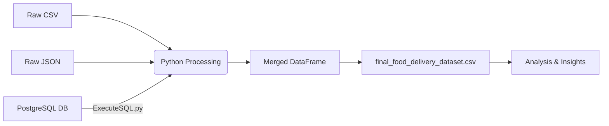

````markdown
# 🚀 Innomatics Research Labs | Entrance Test

### 🎓 Advanced GenAI Internship


> **Project Goal:** To engineer a robust **ETL pipeline** that ingests heterogeneous data (JSON, SQL, CSV), processes it via Python, and generates a unified dataset for analytics.

---

## 📋 Table of Contents

- [Project Overview](#-project-overview)
- [Pipeline Workflow](#-pipeline-workflow)
- [Folder Structure](#-folder-structure)
- [Tech Stack](#-tech-stack)
- [How to Run](#-how-to-run)

---

## 🔄 Pipeline Workflow


````

---

## 📂 Folder Structure

| File Name                         | Description                                                                      |
| --------------------------------- | -------------------------------------------------------------------------------- |
| `ExecuteSQL.py`                   | 🔌 **Database Handler:** Connects to Postgres, runs SQL dumps, and fetches data. |
| `analysis_notebook.ipynb`         | 🧠 **Core Logic:** Handles ingestion, merging, and final analysis.               |
| `final_food_delivery_dataset.csv` | 📊 **Output:** The cleaned and merged final dataset.                             |
| `.env.example`                    | 🔐 **Security:** Template for storing database credentials safely.               |

---

## 🛠 Tech Stack

- **Language:** Python
- **Data Manipulation:** Pandas, NumPy
- **Database:** PostgreSQL
- **Database Adapter:** `psycopg2`
- **Security:** `python-dotenv` (Environment variable management)

---

## ⚡ Key Features

### 1. 🔐 Secure Database Integration

Instead of manual exports, the project uses a custom script to securely connect to a local PostgreSQL instance.

- **Security:** Uses `.env` to keep passwords safe (never hardcoded).
- **Automation:** Executes raw SQL dumps to initialize tables on the fly.

### 2. 🧩 Complex Data Merging

The pipeline handles three different data formats:

- **JSON:** Parsed semi-structured data.
- **SQL:** Extracted relational data via direct DB connection.
- **CSV:** Standard flat-file ingestion.

---

## 🚀 How to Run

### Step 1: Clone the Repo

```bash
git clone https://github.com/Prayaksh/Innomatics-Research-Labs-Hackathon.git
cd Innomatics-Research-Labs-Hackathon

```

### Step 2: Install Requirements

```bash
pip install pandas psycopg2-binary python-dotenv notebook

```

### Step 3: Setup Credentials

Create a `.env` file (you can copy `.env.example`) and add your database details:

```ini
DB_HOST=localhost
DB_NAME=your_db_name
DB_USER=your_username
DB_PASS=your_password
DB_PORT=5432

```

### Step 4: Run Analysis

```bash
jupyter notebook analysis_notebook.ipynb

```

---

_Authored by Prayaksh_

```

```
